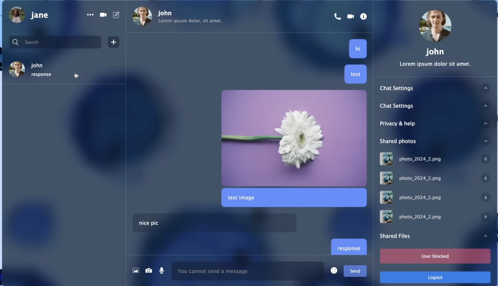

# 💬 Real-Time Chat Application

A modern, feature-rich real-time chat application built with React and Firebase, featuring instant messaging, image sharing, camera integration, and user authentication.


---

## 📸 Application Screenshots

### Authentication Interface


_Secure Firebase authentication with dual-panel design for login and registration_

The authentication system features:

- Email/password authentication via Firebase Auth
- Separate login and registration flows in a split-panel design
- Avatar upload functionality for user profiles
- Clean, modern dark theme UI
- Input validation and error handling

### Main Chat Application


_Real-time chat application with glassmorphism UI, image sharing, and privacy controls_

The main interface showcases:

- Real-time messaging with instant delivery
- Rich media support (image upload and camera integration)
- Three-panel responsive layout (chat list, conversation, user details)
- User blocking and privacy management
- Shared media gallery
- Glassmorphism design with backdrop blur effects

---

## ✨ Features

### 🔐 Authentication

- Secure User Authentication with Firebase Auth
- User registration and login functionality
- Profile avatars and usernames
- Persistent session management

### 💬 Real-Time Messaging

- Instant message delivery using Firebase Firestore
- Real-time message synchronization
- Message read/unread status tracking
- Last message preview in chat list
- Automatic scroll to latest messages

### 📸 Rich Media Support

- Image Sharing via file upload
- Camera Integration for capturing and sending photos
- Cloudinary Integration for optimized image storage and delivery
- Image preview before sending
- Shared media gallery

### 😊 Enhanced User Experience

- Emoji Picker for expressive messaging
- Smooth scrolling to latest messages
- Glassmorphism UI design with backdrop blur effects
- Responsive layout for various screen sizes
- Toast notifications for user feedback

### 🔒 Privacy & Security

- User Blocking functionality
- Blocked users cannot send messages
- Secure message storage with Firebase
- Protected authentication flow

### 🎨 Modern UI/UX

- Clean, intuitive interface
- Beautiful background imagery
- Glassmorphism design patterns
- Dark theme with modern aesthetics
- Three-panel responsive layout

---

## 🚀 Tech Stack

### Frontend

- **React** 18.2.0 - UI library
- **Vite** - Fast build tool and dev server
- **Tailwind CSS** - Utility-first styling
- **CSS3** - Custom styling and animations

### Backend & Services

- **Firebase Auth** - User authentication
- **Firebase Firestore** - Real-time database
- **Firebase Storage** - Media storage
- **Cloudinary** - Image optimization and CDN

### Key Libraries

- **Zustand** - Lightweight state management
- **emoji-picker-react** - Emoji selection component
- **react-toastify** - Toast notifications

---

## 📋 Prerequisites

Before you begin, ensure you have the following installed:

- **Node.js** (v16 or higher)
- **npm** or **yarn**
- A **Firebase account**
- A **Cloudinary account** (for image uploads)

---

## 🛠️ Installation

### 1. Clone the repository

```bash
git clone https://github.com/VEDITHREDDY26/chat-application.git
cd chat-application
```

### 2. Install dependencies

```bash
npm install
```

### 3. Set up environment variables

Create a `.env` file in the root directory:

```env
VITE_API_KEY=your_firebase_api_key
```

### 4. Configure Firebase

Update `src/lib/firebase.js` with your Firebase configuration:

```javascript
const firebaseConfig = {
  apiKey: import.meta.env.VITE_API_KEY,
  authDomain: "your-app.firebaseapp.com",
  projectId: "your-project-id",
  storageBucket: "your-app.firebasestorage.app",
  messagingSenderId: "your-messaging-sender-id",
  appId: "your-app-id",
};
```

### 5. Configure Cloudinary

Update the upload configuration in `src/Components/chat/Chat.jsx`:

```javascript
data.append("upload_preset", "your-upload-preset");
data.append("cloud_name", "your-cloud-name");
```

---

## 🎯 Usage

### Development Mode

Start the development server:

```bash
npm run dev
```

The application will be available at `http://localhost:5173` (or another port if 5173 is busy).

### Build for Production

Create a production build:

```bash
npm run build
```

### Preview Production Build

Preview the production build locally:

```bash
npm run preview
```

---

## 📁 Project Structure

```
chat-application/
├── public/                 # Public assets (icons, images)
│   ├── avatar.png
│   ├── camera.png
│   ├── emoji.png
│   ├── img.png
│   ├── info.png
│   ├── mic.png
│   ├── phone.png
│   └── video.png
├── screenshots/           # Application screenshots
│   ├── auth-screen.png
│   └── main-interface.png
├── src/
│   ├── assets/            # Application assets
│   ├── Components/
│   │   ├── chat/          # Chat component & styling
│   │   │   ├── Chat.jsx
│   │   │   └── Chat.css
│   │   ├── detail/        # User detail sidebar
│   │   │   ├── Detail.jsx
│   │   │   └── Detail.css
│   │   ├── list/          # Chat list & user info
│   │   │   ├── List.jsx
│   │   │   ├── chatList/
│   │   │   │   ├── ChatList.jsx
│   │   │   │   └── AddUser1.jsx
│   │   │   └── userInfo/
│   │   │       └── UserInfo1.jsx
│   │   ├── Login/         # Authentication
│   │   │   └── Login.jsx
│   │   └── notification/  # Toast notifications
│   │       └── notification.jsx
│   ├── lib/               # Utilities & stores
│   │   ├── firebase.js    # Firebase configuration
│   │   ├── UserStore.js   # User state management
│   │   └── ChatStore.js   # Chat state management
│   ├── App.jsx            # Main application component
│   ├── main.jsx           # Application entry point
│   └── index.css          # Global styles
├── .env                   # Environment variables
├── package.json
├── vite.config.js
└── README.md
```

---

## 🎮 Key Features Explained

### State Management with Zustand

The application uses Zustand for efficient, lightweight state management:

- **UserStore**: Manages current user authentication state and user data
- **ChatStore**: Manages active chat sessions, selected users, and chat metadata

### Real-Time Updates

Firebase Firestore listeners provide real-time updates:

- Messages appear instantly for all participants
- User status changes reflect immediately
- Last message updates across all chat lists
- Online/offline status tracking

### Image Upload Flow

1. User selects image via file picker or captures via camera
2. Preview displayed before sending
3. Image uploaded to Cloudinary for optimization
4. Secure URL stored in Firestore
5. Image rendered in chat with proper loading states

### Privacy Controls

- User blocking prevents message delivery
- Blocked status persists across sessions
- Clear visual feedback when user is blocked
- Easy unblock functionality

---

## 🔧 Configuration

### Firebase Setup

1. Create a Firebase project at [Firebase Console](https://console.firebase.google.com/)
2. Enable Authentication (Email/Password)
3. Enable Firestore Database
4. Enable Storage
5. Add your config to `src/lib/firebase.js`

### Cloudinary Setup

1. Sign up at [Cloudinary](https://cloudinary.com/)
2. Create an upload preset in Settings → Upload
3. Update credentials in `Chat.jsx`

---

## 🐛 Troubleshooting

### Common Issues

**Issue: Images not uploading**

- Solution: Verify Cloudinary credentials and upload preset are correct
- Check browser console for CORS errors
- Ensure upload preset is set to "unsigned"

**Issue: Messages not sending**

- Solution: Check Firebase Firestore rules and authentication status
- Verify Firebase configuration in `firebase.js`
- Check browser console for Firebase errors

**Issue: Camera not starting**

- Solution: Ensure browser permissions for camera access are granted
- Check HTTPS connection (camera requires secure context)
- Verify browser compatibility

**Issue: Real-time updates not working**

- Solution: Check Firestore listener setup
- Verify internet connection
- Check Firebase quota limits

---

## 🚀 Performance Optimizations

- **Image Optimization**: Cloudinary automatically optimizes and compresses images
- **Lazy Loading**: Messages and images load progressively
- **State Management**: Zustand provides minimal re-renders
- **Firebase Indexing**: Proper Firestore indexing for fast queries
- **Code Splitting**: Vite handles automatic code splitting

---

## 🔮 Future Enhancements

- [ ] Voice and video calling integration
- [ ] Group chat functionality
- [ ] Message reactions and replies
- [ ] Read receipts with timestamps
- [ ] Push notifications
- [ ] Message search functionality
- [ ] File sharing (documents, videos)
- [ ] Dark/Light theme toggle
- [ ] End-to-end encryption
- [ ] Message deletion and editing

---

## 🤝 Contributing

Contributions are welcome! Please follow these steps:

1. Fork the repository
2. Create a feature branch (`git checkout -b feature/AmazingFeature`)
3. Commit your changes (`git commit -m 'Add some AmazingFeature'`)
4. Push to the branch (`git push origin feature/AmazingFeature`)
5. Open a Pull Request

---

## 👤 Author

**Vedith Reddy Kommula**

- Email: vedithreddykommula@gmail.com
- LinkedIn: https://www.linkedin.com/in/vedith-reddy-kommula/
- GitHub: https://github.com/VEDITHREDDY26
- ***

## 🙏 Acknowledgments

- [Firebase](https://firebase.google.com/) for backend infrastructure and real-time capabilities
- [Cloudinary](https://cloudinary.com/) for image optimization and delivery
- [React](https://react.dev/) community for excellent libraries and support
- [emoji-picker-react](https://www.npmjs.com/package/emoji-picker-react) for emoji integration
- [Zustand](https://github.com/pmndrs/zustand) for simple state management
- [Vite](https://vitejs.dev/) for lightning-fast development experience

---

## 📄 License

This project is licensed under the MIT License - see the LICENSE file for details.

---

## 📧 Contact

For questions, feedback, or collaboration opportunities, feel free to reach out:

- **Email**: vedithreddykommula@gmail.com
- **GitHub Issues**: [Open an issue](https://github.com/yourusername/chat-application/issues)

---

**Happy Chatting! 💬✨**

Built with ❤️ using React, Firebase, and modern web technologies.
